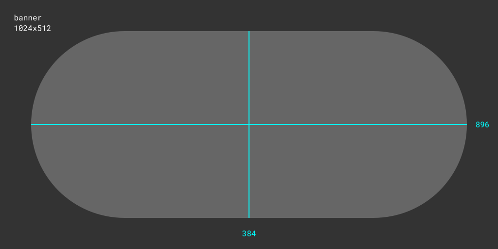

# Untitled Game



## A memorable tagline.

A brief, plain-text description of your game. Give players a quick sense of what to expect in a few short sentences. It appears under your game's title on the store page.

---

Tell players about your game here. This section becomes your game's description. It appears in the **About** section on the store page. Expand on your game, highlight its features, embed **PNG images** and **MP4 videos** from the .arcadible/gallery directory, and format your description with [Arcadible Markdown](https://developer.arcadible.com/references/arcadible-markdown).

---

Everything after the last horizontal rule is ignored by Arcadible. Use this section for development notes, build instructions, or other repository documentation.

For larger projects, you can instead create an `arcadible.md` file to keep your store page content separate from your repository's `README.md`.

## Develop

The game is built with [Three.js](https://threejs.org/docs/) and [Vite](https://vite.dev), into `.arcadible-public/`.

```sh
npm install
npm run dev     # a local server that reloads as you edit
arc deploy      # builds, then publishes
```

### References

- [Arcadible Manifest](https://developer.arcadible.com/references/arcadible-manifest)
  - [game.title](https://developer.arcadible.com/references/arcadible-manifest#game.title)
  - [game.tagline](https://developer.arcadible.com/references/arcadible-manifest#game.tagline)
  - [game.bio](https://developer.arcadible.com/references/arcadible-manifest#game.bio)
  - [game.description](https://developer.arcadible.com/references/arcadible-manifest#game.description)
  - [game.gallery](https://developer.arcadible.com/references/arcadible-manifest#game.gallery)
